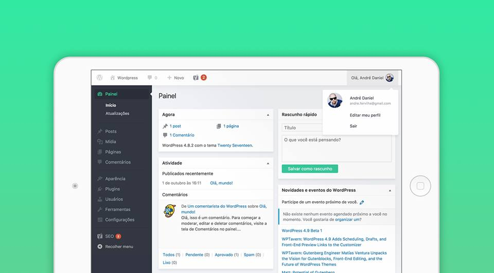

# Influid Admin

Simple theme to customize WordPress admin. It is completely free.



## Requirements

This plugin requires the verion >= 4.6 of WordPress and PHP version >= 5.4.

## How to install the plugin

```
  1. Upload 'influid-admin' folder to the '/wp-content/plugins/' directory
  2. Activate the plugin through the 'Plugins' menu in WordPress
  3. Enjoy!
```

## On the version 0.1 we have
- CSS styles;

## License

This project have a GPLv2 or later license.
Checkout the license: http://www.gnu.org/licenses/gpl-2.0.html
